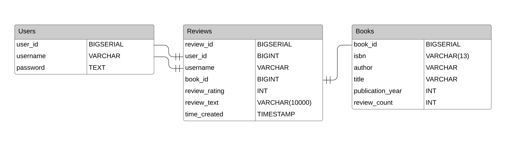
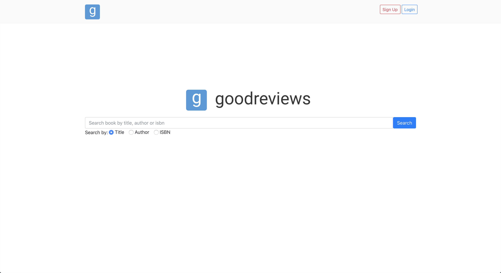
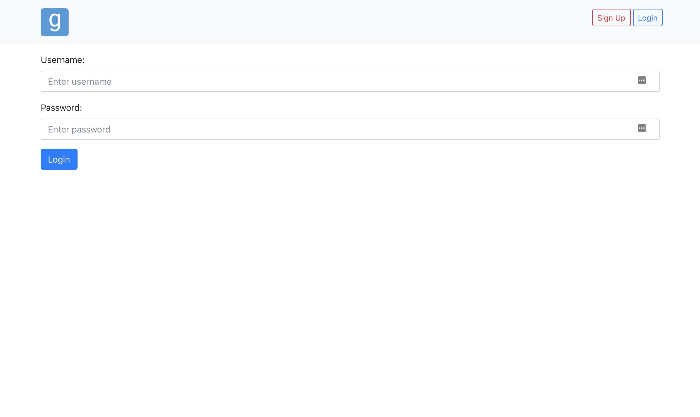
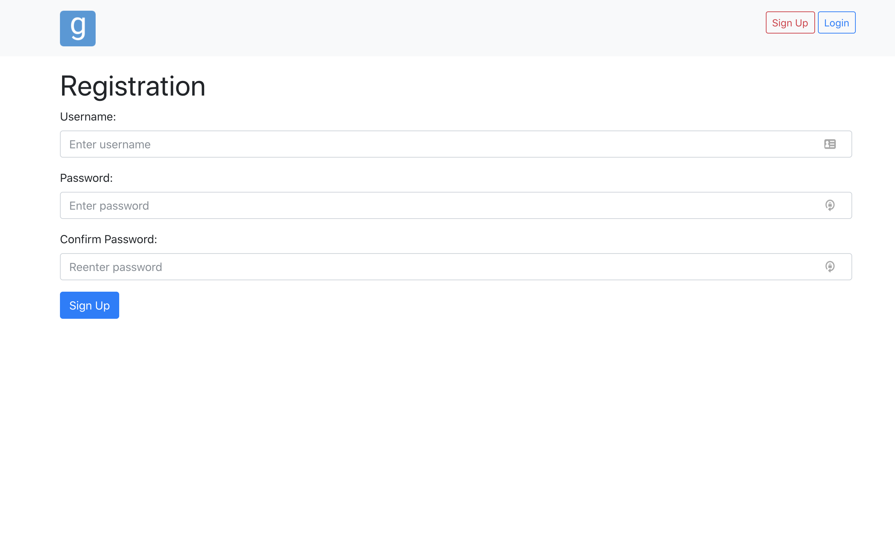
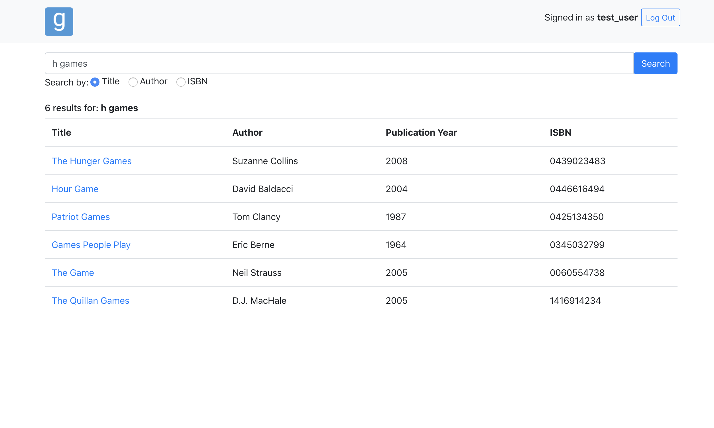
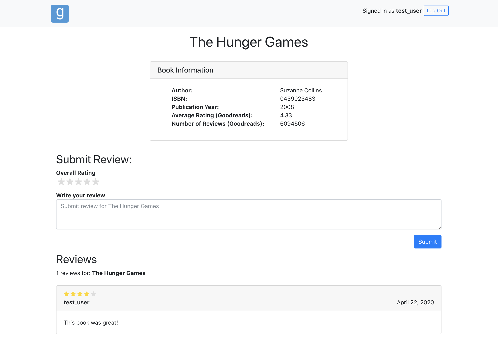
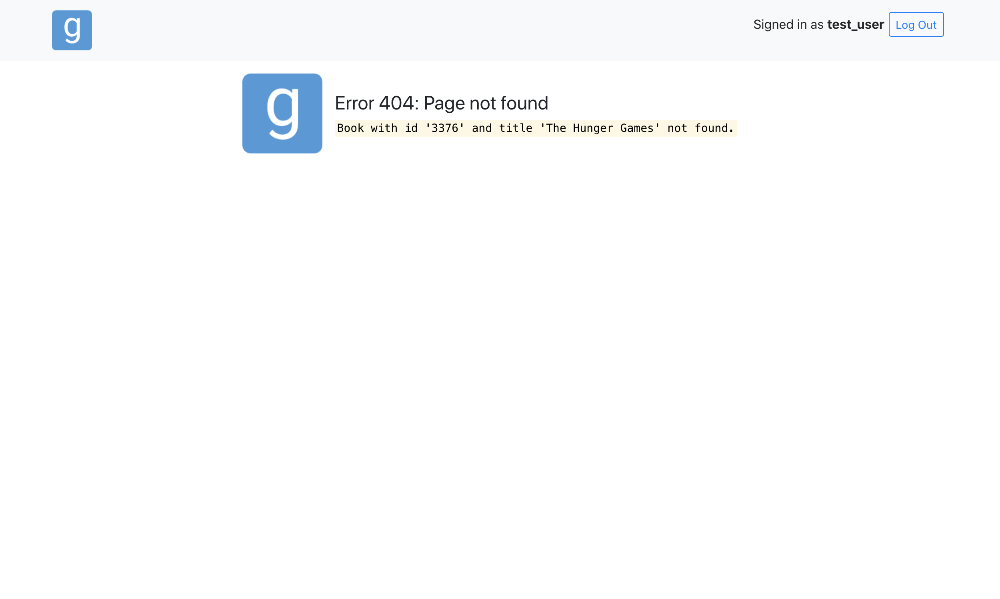

# Project 1 - Books

## Installation

1. Pre-installation: Follow the **Getting Started** instructions at [https://docs.cs50.net/web/2020/x/projects/1/project1.html.](https://docs.cs50.net/web/2020/x/projects/1/project1.html.)
2. Install python dependencies for custom features using `pip install -r requirements.txt`
3. Place Goodreads API key in project root directory in a file named `GOODREADS_API_KEY` (see below for directory structure).

## Usage

1. After getting Flask running (see [CS50 Getting Started](https://docs.cs50.net/web/2020/x/projects/1/project1.html)), run `python3 setup_db.py` to set up the tables, columns, relations in the database and install "pg_trgm" if needed.
2. Run `python3 import.py [-t TARGET]` to import books from [TARGET], defaulting to `books.csv` instead. Imported CSV file should have header row `isbn,title,author,year` and body consistent with header.
3. The application should be running locally on `http://localhost:5000/`

## Design

### Features

- Search
  - The **pg_trgm** module was used, which uses trigram similarity in ranking results.
    - Results are displayed in similarity order, descending (highest to loweest).
    - Effective for queries like ('Lucas Chen' vs 'Chen Lucas' - which would have high similarity).
    - Default `similarity = 0.3`
  - Alternative 1: the `levenshtein` module matches based on levenshtein distance.
  - Alternative 2: the `soundex` module matches based on metaphones, which is useful for homonyms (e.g. flower and flour).
- Login: Bcrypt is used to hashed passwords (default 12 rounds of salt)

### Database



- `BIGSERIAL` was chosen for database id's for scalability
- The `user_id` column is used as the primary key instead of `username`, to potentially allow for the feature of a user changing their username.
- `VARCHAR(13)` is used for `ISBN` instead of `BIGINT`, since numerical values remove leading 0s.

## Project Structure

```markdown
.
├── GOODREADS_API_KEY
├── README.md
├── application.py
├── books.csv
├── import.py
├── requirements.txt
├── setup_db.py
├── static
│   ├── favicon.ico
│   ├── logo-full.png
│   └── logo-mini.png
├── templates
│   ├── book.html
│   ├── error.html
│   ├── index.html
│   ├── layout.html
│   ├── login.html
│   ├── register.html
│   └── search.html
└── test.py
```

- **GOODREADS_API_KEY**: Store API key for Goodreads
- **application.py**: Main flask web application
- **books.csv**: A spreadsheet in CSV format of 5000 different book, with an ISBN number, title, author, and publication year.
- **import.py**: Take in books in csv file and imports them into PostgreSQL database
- **setup_db.py**: Sets up necessary tables, columns, and relations in PostgreSQL. Creates a `users`, `books`, and `reviews` table.
- **templates/book.html**: Displays book information, allows registered users to submit reviews, and displays reviews from other users.
- **templates/error.html**: Error page if attempting to access an unavailable resource.
- **templates/index.html**: Home page with search bar.
- **templates/layout.html**: Jinja layout template for all the routes on the site.
- **templates/login.html**: User login page, redirecting upon login to previous page.
- **templates/register.html**: User sign up page, redirecting upon login to home page (automatically signing in user).
- **templates/search.html**: Search page with search bar and search results.

## Images

### Home Page



### Login Page



### Registration Page



### Search Page



### Book Page



### Error Page



## To Do/Features to add

- [x] Ability to dismiss alerts
- [x] Registration page button on navbar
- [x] Revamp error page design
- [x] Rename:
  - [x] Userid, bookid and reviewid -> user_id, book_id, review_id
  - [x] rating_num, rating_text -> review_rating, review_text
- [x] Keep track of session using user_id, not username
  - [x] Note: Username was used in the end (for displaying username on navbar, unless 2 variables are to be tracked)
- [x] Make API access private
  - [x] Handle invalid API key
- [x] Store hash of passwords instead of cleartext
- [x] Logouts redirect to referrer page, unless coming from search page
- [x] Change search method to GET
  - [x] Allows for redirection to search page (e.g. after logout). GET is the best way to handle query strings - non-secure data where user might want to bookmark
- [x] Change logo to sans-serif font logo
- [x] Using/animating stars for submittinng and displaying reviews
- [x] Require on username/password for login and sign up
- [ ] Paginate search results
- [ ] Edit review function
- [ ] Add password length limit of 50 (Bcrypt has a maximum length of 56 bytes)
- [ ] Add change username/password function
- [ ] Display average rating for site users on book page

## References

- [Password hashing in Python with Brypt](https://pythonise.com/categories/python/python-password-hashing-bcrypt)
- [Fuzzy string matching with PostgreSQL](https://www.freecodecamp.org/news/fuzzy-string-matching-with-postgresql/)
